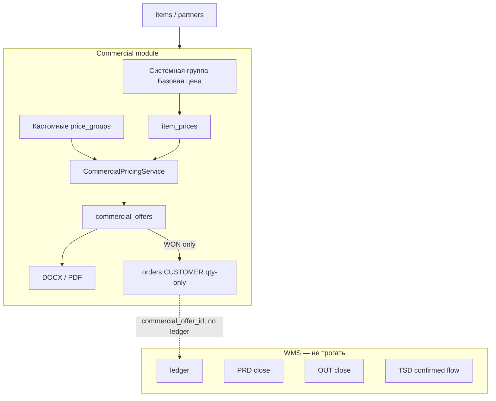

# Commercial / CRM-lite — актуальная модель (as-built)

**Версия:** v3 (фактическая реализация)  
**Статус:** документация по коду  
**Дата:** 2026-05-24  
**Код:** `apps/windows/FlowStock.Core/Commercial`, `FlowStock.Data/PostgresCommercialDataStore`, `FlowStock.Server/Commercial*Endpoints`, WPF `FlowStock.App`

> Этот документ описывает **фактическое** поведение после внедрения модели «Базовая цена» (миграция `V0028`) и связанных правок. Устаревшая модель «цена задаётся только на экране Коммерция / Цены» **не** применяется: основной UX базовой цены — **карточка товара → «Цена»**.

---

## 1. Overview

### Что такое Commercial / CRM-lite

Изолированный модуль поверх справочников `items` и `partners`, который закрывает коммерческий контур **без** участия складского `ledger` и без автоматического закрытия документов WMS.

### Задачи модуля

| Область | Назначение |
|---------|------------|
| **Цены** | Группы цен, базовая цена товара, правила групп, индивидуальные override, расчёт цены для КП |
| **Ценовые группы** | Системная «Базовая цена» + пользовательские группы со скидкой/наценкой |
| **КП (коммерческие предложения)** | Черновик → статусы CRM → замороженные цены в строках |
| **DOCX / PDF** | Шаблоны Word, подстановка полей, генерация файлов |
| **Ценники** | Пакетная генерация (`price_tag_batches`) с ценой из pricing quote |
| **Мини-CRM** | Статусы КП, история переходов, follow-up (`next_follow_up_at`), дублирование КП |

### Изоляция от WMS

Commercial **не** вызывает:

- запись в `ledger`;
- `CloseDocument` / auto-close PRD / OUT;
- TSD-confirmed outbound flow;
- резервирование HU и production pallet flow.

Связь с заказами — только **Phase 7**: из КП в статусе `WON` создаётся `CUSTOMER` order **только с количествами** (`order_lines.qty_ordered`), без цен и без `ledger`.



---

## 2. Boundaries / инварианты

| Инвариант | Реализация |
|-----------|------------|
| Остатки только из `ledger` | Commercial не пишет в `ledger` |
| PRD/OUT не закрываются из Commercial | Нет вызовов close-document |
| TSD flow не затрагивается | Нет изменений TSD endpoints |
| Создание КП | Только записи в `commercial_*`; склад не двигается |
| Заказ из WON КП | `CommercialOfferService.CreateCustomerOrderFromWonOffer`: `AddOrder` + `AddOrderLine` (qty), `SetOrderCommercialOfferId`; **без** цен в `order_lines` |
| Цена в КП | **Frozen snapshot** в `commercial_offer_lines` при добавлении строки; пересчёт только в `DRAFT` по кнопке «Пересчитать цены» |
| Silent zero | `PRICE_NOT_FOUND` / `PRICE_IS_ZERO` при quote и добавлении строки; `UpsertItemPrice` отклоняет цену `0`; `final_price <= 0` запрещён |

---

## 3. Price model

### 3.1. Системная группа «Базовая цена»

| Поле / факт | Значение |
|-------------|----------|
| Имя | `Базовая цена` (`CommercialPricingConstants.BasePriceGroupName`) |
| `is_system` | `true` (миграция `V0028`, partial unique index) |
| `is_default` | `true` (единственная default-группа) |
| `is_active` | всегда `true` (API запрещает деактивацию) |
| `default_discount_percent` / `default_markup_percent` | `0` для системной группы |
| Валюта по умолчанию | `RUB`, `vat_mode = INCLUDED` |

**Создание / поддержка:**

- Миграция `V0028` нормализует существующую «базовую» группу и вставляет системную, если её нет.
- При старте сервера: `EnsureSystemBasePriceGroup()` в `Program.cs` (при ошибке — warning в лог, без падения процесса).

**Почему нельзя удалить / сломать:**

- `POST /api/price-groups/{id}/deactivate` → `SYSTEM_GROUP_PROTECTED` для `is_system`.
- `POST /api/price-groups/{id}`: нельзя снять `is_active` или `is_default`, нельзя переименовать (`SYSTEM_GROUP_NAME_PROTECTED`).
- `POST /api/price-groups`: нельзя создать группу с `is_system` или `is_default` (`SYSTEM_GROUP_PROTECTED` / запрет второй default).
- Пользовательские группы не могут стать `is_default` (`ONLY_SYSTEM_GROUP_CAN_BE_DEFAULT`).

### 3.2. Все товары в базовой группе (логически)

Каталог **всех** `items` показывается в прайс-листе любой группы (`GetItemPriceCatalogForGroup` — `FROM items` без фильтра `is_active`). Для базовой группы отсутствие строки в `item_prices` означает **«базовая цена не задана»**, а не «товара нет в группе».

### 3.3. «Базовая цена не задана»

- Нет активной записи `item_prices` для пары `(item_id, system_base_price_group_id)` на дату `as_of`, **или** `price <= 0`.
- UI: «не задана», подсветка строк без `has_base_price` на «Коммерция / Цены».
- Quote / добавление в КП: `PRICE_NOT_FOUND` (не подставляется `0`).
- Сохранение override в кастомной группе без базы: `PRICE_NOT_FOUND` в `UpsertItemPrice`.

### 3.4. Где физически хранится базовая цена

Таблица `item_prices`:

- `item_id` + `price_group_id` = ID системной группы «Базовая цена»;
- активная цена: `is_active = true`, `valid_from <= as_of`, `valid_to IS NULL OR valid_to >= as_of`;
- при новом периоде — `CloseOverlappingActiveItemPrices` закрывает пересекающиеся активные записи.

### 3.5. Кастомные группы цен

Пользовательские группы (`is_system = false`):

| Механизм | Поля | Поведение |
|----------|------|-----------|
| Правило группы | `default_discount_percent`, `default_markup_percent` | Цена = базовая − скидка%, затем + наценка% (см. формулы ниже) |
| Индивидуальный override | `item_prices` для `(item, custom_group)` | Если активная цена `> 0`, используется **override**, правило группы игнорируется |
| Без базовой цены | — | Итоговая цена отсутствует (`PRICE_NOT_FOUND`) |

Редактирование правил группы: WPF `PriceGroupEditWindow` (скидка % / наценка %). Системную группу в UI редактировать нельзя.

### 3.6. Типы цены (источник)

Коды `PriceSourceKind` / API `price_source`:

| Код | UI | Когда |
|-----|-----|-------|
| `BASE` | Базовая цена | Выбрана системная группа или отображение базы в overview |
| `GROUP_RULE` | Правило группы | Кастомная группа, нет override, есть базовая цена |
| `GROUP_OVERRIDE` | Индивидуальная цена | Активный `item_prices` в кастомной группе |
| `MANUAL` | Ручная цена | Зарезервировано в enum; **в текущем quote pipeline не выставляется** |

Отдельно от источника групповой цены:

- **Скидка контрагента** — `partner_commercial_settings.default_discount_percent` (после group price).
- **Ручная скидка строки КП** — `manual_discount_percent` при `AddLineFromQuote` / quote (после скидки контрагента).

### 3.7. Формулы (фактический код)

`CommercialPricingService`:

```text
group_rule_price = Round4(base * (1 - discount%/100) * (1 + markup%/100))
partner_price    = Round4(group_price * (1 - partner_discount%/100))
final_price      = Round4(partner_price * (1 - manual_discount%/100))
line_total       = Round2(final_price * qty)
```

`CombineSequentialPercent` для отображения суммарного % скидки в строке КП: последовательное применение partner + manual, cap 100%.

---

## 4. Pricing calculation pipeline

Пошагово (`CommercialPricingService.Quote`):

1. **Resolve price group** (`ResolvePriceGroupId`):
   - если в запросе / КП задан `price_group_id` (override) — он;
   - иначе `partner_commercial_settings.price_group_id` (если настройки активны по `valid_from`/`valid_to`);
   - иначе **системная группа «Базовая цена»** (`RequireSystemBasePriceGroup`).

2. **Resolve base (catalog) price** — активный `item_prices` для `item_id` + **system base group**. Если нет или `<= 0` → **`PRICE_NOT_FOUND`**.

3. **Resolve group price** (`CalculateGroupPrice`):
   - системная группа → `group_price = catalog_base`, source `BASE`;
   - кастомная + override `> 0` → `group_price = override`, source `GROUP_OVERRIDE`;
   - кастомная без override → правило скидки/наценки, source `GROUP_RULE`.
   - если `group_price <= 0` → **`PRICE_IS_ZERO`**.

4. **Partner discount** — `partner_commercial_settings.default_discount_percent`.

5. **Manual discount** — из запроса / строки КП.

6. **Round** — unit `4` знака, деньги `2` знака (`RoundUnitPrice`, `RoundMoney`).

7. **Freeze в КП** — в `commercial_offer_lines` сохраняются `base_price` (= **group price** на момент quote), `final_price`, `*_discount_percent`, `line_total`. Поле `volume_discount_percent` в quote всегда **0** (см. volume rules ниже).

Если скидки приводят к `final_price <= 0`, quote возвращает **`PRICE_IS_ZERO`**. Сценарий `manual_discount_percent = 100` в текущей версии не поддерживается; бесплатные образцы должны быть отдельной явной функцией, а не скрытой нулевой ценой.

### Примеры

| Сценарий | Расчёт |
|----------|--------|
| База 100, группа −15% | `100 * 0.85 = 85` |
| Override 76 | `76` (база всё равно должна существовать для quote) |
| Group 85, partner −5% | `85 * 0.95 = 80.75` |
| После partner manual −10% | `80.75 * 0.90 = 72.675` → round 72.6750 / line_total по qty |
| Нет базовой цены | `PRICE_NOT_FOUND` |
| База есть, group price 0 | `PRICE_IS_ZERO` |

### Volume discount rules (важно)

- Таблица `volume_discount_rules` и API `GET/POST /api/commercial/volume-discount-rules` **существуют** (миграция `V0027`).
- В **`Quote` pipeline volume скидки не применяются** (`VolumeDiscountPercent = 0` в результате; логика `ResolveVolumeDiscount` удалена из актуального сервиса).
- Колонка `commercial_offer_lines.volume_discount_percent` сохраняется для совместимости DOCX, обычно `0`.

---

## 5. DB schema summary

Миграции commercial: **`V0023` … `V0028`** (`deploy/postgres/migrations/`).

| Таблица | Назначение | Ключевые поля | Ограничения / запреты |
|---------|------------|---------------|------------------------|
| **price_groups** | Справочник групп | `name`, `currency`, `vat_mode`, `is_default`, `is_system`, `is_active`, `default_discount_percent`, `default_markup_percent` | Одна `is_system=true`, одна `is_default=true` (partial unique, V0028); уникальность `name` (V0023) |
| **partner_commercial_settings** | Коммерция контрагента | `partner_id` PK, `price_group_id`, `default_discount_percent`, `payment_terms`, `delivery_terms`, `valid_from`/`valid_to` | FK на `partners`, `price_groups` |
| **item_prices** | Цена товара в группе | `item_id`, `price_group_id`, `price NUMERIC(18,4)`, `valid_from` DATE, `valid_to`, `is_active` | Не использовать `REAL`; периоды не должны пересекаться без закрытия старых |
| **commercial_offers** | Заголовок КП | `offer_ref` UNIQUE, `partner_id`, `price_group_id`, `status`, суммы, `converted_order_id` | Статус TEXT; ссылка на группу обязательна |
| **commercial_offer_lines** | Строки КП | `base_price`, `final_price`, `line_total`, скидки | CASCADE delete с offer; **frozen** после выхода из DRAFT |
| **commercial_offer_status_history** | Аудит статусов | `old_status`, `new_status`, `changed_at`, `changed_by` | Пишется при каждом `ChangeStatus` |
| **commercial_templates** | DOCX-шаблоны | `template_type`, `file_path`, `is_default` | Файл на диске + метаданные |
| **generated_documents** | Сгенерированные файлы | `source_type`, `source_id`, `output_format`, `file_path` | Например `COMMERCIAL_OFFER` + offer id |
| **price_tag_batches** / **price_tag_batch_lines** | Партии ценников | `price_group_id`, `item_id`, `copies`, `price` | Цена в line может быть из quote |
| **volume_discount_rules** | Объёмные скидки (задел) | `scope_type`, `min_qty`, `discount_percent` | **Не в quote pipeline** |
| **orders.commercial_offer_id** | Связь заказа с КП | FK `commercial_offers(id)` | Только обратная связь; заказ без цен из КП |

Типы: деньги `NUMERIC(18,4)` / `NUMERIC(18,2)`, проценты `NUMERIC(7,4)`, qty `REAL`, даты `DATE` / `TIMESTAMPTZ`.

---

## 6. WPF UX

Клиент: `FlowStock.App`, данные commercial — через **`WpfCommercialApiService`** → HTTP API сервера (не прямой SQL для цен/КП).

### 6.1. Коммерция / Цены

Вкладка **«Коммерция / Цены»** (`MainWindow`):

- **Слева:** список групп (системная «Базовая цена» сверху, колонка «Системная»).
- **Справа:** все товары каталога для выбранной группы.
- Колонки: базовая цена, итоговая, источник цены; строки **без базовой цены** подсвечены.
- Фильтр «Только без цены», поиск по названию / штрихкоду / GTIN.
- **Редактирование системной группы** — заблокировано (сообщение при попытке).
- **Задать / изменить цену** — `ItemPriceEditWindow` для выбранного товара и группы.
- **Отключить цену** — deactivate активного `item_prices` (для override в кастомной группе).

### 6.2. Карточка товара — основной UX базовой цены

`ItemEditWindow` (редактирование существующего товара):

- Кнопка **«Цена»** → `ItemPricesWindow`.

`ItemPricesWindow`:

| Блок | Содержание |
|------|------------|
| Шапка | Наименование, ID, штрихкод/GTIN |
| **Базовая цена** | Поля цена, валюта, период, комментарий; **«Сохранить базовую цену»** → `POST /api/items/{id}/prices` в системную группу |
| Таблица групп | Все активные группы: тип цены, скидка/наценка группы, override, **итоговая** |
| Действия | «Задать индивидуальную цену» (кастомная группа), «Убрать индивидуальную цену» (deactivate override) |

Для нового товара (ещё без ID) кнопка «Цена» недоступна — сначала сохранить товар.

### 6.3. Контрагент

`PartnerEditWindow`: ценовая группа по умолчанию, `default_discount_percent`, условия оплаты/доставки → `partner_commercial_settings`.

### 6.4. Коммерция / КП

| Действие | UI |
|----------|-----|
| Создать КП | «Коммерция / КП» → «Создать КП» → `CommercialOfferCreateWindow`: **контрагент** (обязателен), **группа цен**, условия |
| Карточка КП | `CommercialOfferWindow`: строки, статусы, пересчёт цен (DRAFT), DOCX/PDF, смена контрагента (DRAFT) |
| Удалить КП | Список КП → «Удалить КП» — только **DRAFT** |
| Ошибка цены | «Для товара не задана базовая цена. Задайте цену в карточке товара (кнопка «Цена»).» |

Группа цен на КП фиксируется в заголовке (`commercial_offers.price_group_id`) и используется как `PriceGroupOverrideId` при quote строк.

---

## 7. Commercial offer lifecycle

### Статусы

| Код | UI (RU) | Terminal |
|-----|---------|----------|
| `DRAFT` | Черновик | нет |
| `SENT` | Отправлено | нет |
| `WAITING_REPLY` | Ожидаем ответа | нет |
| `REJECTED` | Отклонено | **да** |
| `WON` | Продано | **да** |
| `EXPIRED` | Истек срок | **да** |
| `CANCELLED` | Отменено | **да** |

### Переходы (`CommercialOfferStatusMapper.CanTransition`)

| Из | В |
|----|---|
| `DRAFT` | `SENT`, `CANCELLED` |
| `SENT` | `WAITING_REPLY`, `REJECTED`, `WON`, `EXPIRED`, `CANCELLED` |
| `WAITING_REPLY` | `REJECTED`, `WON`, `EXPIRED`, `CANCELLED` |
| terminal | *(нет исходящих)* |

Неверный переход → `INVALID_STATUS_TRANSITION`.

### Правила редактирования

| Операция | DRAFT | SENT / WAITING | Terminal |
|----------|-------|----------------|----------|
| Редактировать заголовок / строки | да | **нет** (`OFFER_NOT_EDITABLE`) | нет |
| Сменить контрагента / группу | да (WPF + API) | нет | нет |
| Добавить / удалить строку | да | нет | нет |
| Пересчитать цены | да | нет | нет |
| Удалить КП | да | нет | нет |
| `SENT` / `WON` без строк | — | `OFFER_LINES_REQUIRED` | — |
| Создать CUSTOMER order | нет | нет | только **`WON`** (`OFFER_NOT_WON` иначе) |

При смене статуса в terminal выставляется `closed_at`. При первом `SENT` — `sent_at`.

**status_history:** каждая смена → запись в `commercial_offer_status_history` (`old_status`, `new_status`, `comment`, `changed_by`, `changed_at`).

**Дублирование:** `Duplicate` создаёт новый КП в `DRAFT` с копией строк (включая frozen цены).

---

## 8. DOCX / PDF templates

### DOCX (primary)

- Загрузка шаблонов: `POST /api/commercial/templates` (multipart), хранение под `FLOWSTOCK_COMMERCIAL_ROOT/templates/{id}/v{version}/`.
- Тип по умолчанию для КП: `CommercialTemplateType.CommercialOffer`.
- Рендер: `DocxPlaceholderRenderer` (Open XML).

**Синтаксис:**

- Скаляр: `{{FieldName}}` — см. `CommercialTemplateFields`.
- Блок строк: `{{#Lines}}` … `{{/Lines}}` — дублирование параграфов шаблона на каждую строку КП.

**Split-run issue:** Word может разбить `{{OfferNumber}}` на несколько `w:t`. Renderer склеивает текст параграфа (`GetParagraphText` / `SetParagraphText`) — покрыто тестом `Render_ReplacesSplitRunPlaceholder`.

**Missing placeholders:** неизвестный ключ → пустая строка (`ReplaceScalars`).

**Генерация КП:** `POST /api/commercial/offers/{id}/generate-docx` → файл в `commercial/generated/offers/{offerId}/`, запись в `generated_documents` (`output_format = DOCX`).

### PDF

- `POST /api/commercial/offers/{id}/generate-pdf`.
- Конвертация: `LibreOfficePdfConverter` (`soffice --headless`), интерфейс `IPdfConverter`.
- Если DOCX ещё нет — генерируется автоматически, затем PDF рядом с тем же именем.
- Требуется установленный **LibreOffice** (`soffice` в PATH) на хосте/в контейнере.

### Справочник полей API

`GET /api/commercial/template-fields` — списки плейсхолдеров для заголовка и блока Lines.

---

## 9. Price tags

`POST /api/commercial/price-tags/generate`:

| Параметр | Назначение |
|----------|------------|
| `price_group_id` | Группа для расчёта |
| `partner_id` (опционально) | Для автоподстановки цены через `Quote` |
| `template_id` | Шаблон ценника (опционально) |
| `lines[]` | `item_id`, `copies`, `price` (опционально) |

Если `price` не задан и указан `partner_id` — цена берётся из `CommercialPricingService.Quote` (`final_price`). Если цену рассчитать нельзя или итог `<= 0`, endpoint возвращает `PRICE_NOT_FOUND` / `PRICE_IS_ZERO` с `item_id` и `line_index`; batch и строки ценников не создаются.

Создаётся `price_tag_batches` + строки `price_tag_batch_lines` с зафиксированной `price`. Отдельного WPF-экрана ценников в текущем UI может не быть — операция API-first.

---

## 10. API summary

Стиль: JSON **snake_case**, обновление сущностей часто через **POST** (не PATCH).

### Price groups

| Method | Path | Назначение |
|--------|------|------------|
| GET | `/api/price-groups` | Список (`include_inactive`) |
| POST | `/api/price-groups` | Создать пользовательскую группу |
| POST | `/api/price-groups/{id}` | Обновить (системную — ограниченно) |
| POST | `/api/price-groups/{id}/deactivate` | Деактивировать (не системную) |
| GET | `/api/price-groups/{id}/item-prices` | Прайс-лист: все товары + base/override/calculated |

### Item prices

| Method | Path | Назначение |
|--------|------|------------|
| GET | `/api/items/{itemId}/prices` | Overview по всем группам (или одна группа с `price_group_id`) |
| POST | `/api/items/{itemId}/prices` | Upsert цены (база или override) |
| POST | `/api/item-prices/{id}/deactivate` | Снять активную цену |

### Partner settings

| Method | Path |
|--------|------|
| GET/POST | `/api/partners/{partnerId}/commercial-settings` |

### Pricing

| Method | Path | Тело (ключевое) |
|--------|------|-----------------|
| POST | `/api/commercial/pricing/quote` | `item_id`, `partner_id`, `qty`, `price_group_id?`, `manual_discount_percent?`, `as_of?` |

Ответ включает: `catalog_base_price`, `group_price`, `final_price`, `price_source`, скидки, `line_total`.

### Commercial offers

| Method | Path |
|--------|------|
| GET | `/api/commercial/offers` |
| POST | `/api/commercial/offers` |
| GET | `/api/commercial/offers/{id}` |
| POST | `/api/commercial/offers/{id}` |
| DELETE | `/api/commercial/offers/{id}` |
| POST | `/api/commercial/offers/{id}/lines` |
| DELETE | `/api/commercial/offers/{id}/lines/{lineId}` |
| POST | `/api/commercial/offers/{id}/recalculate-prices` |
| POST | `/api/commercial/offers/{id}/status` |
| POST | `/api/commercial/offers/{id}/duplicate` |
| POST | `/api/commercial/offers/{id}/create-order` |

### Templates & documents

| Method | Path |
|--------|------|
| GET | `/api/commercial/template-fields` |
| GET/POST | `/api/commercial/templates` |
| POST | `/api/commercial/templates/{id}/set-default` |
| GET | `/api/commercial/generated-documents` |
| POST | `/api/commercial/offers/{id}/generate-docx` |
| POST | `/api/commercial/offers/{id}/generate-pdf` |

### Volume rules (задел)

| Method | Path |
|--------|------|
| GET/POST | `/api/commercial/volume-discount-rules` |

### Частые коды ошибок

| Код | Когда |
|-----|-------|
| `PRICE_NOT_FOUND` | Нет базовой цены |
| `PRICE_IS_ZERO` | Нулевая group/final цена |
| `PARTNER_NOT_FOUND` | Нет контрагента |
| `PRICE_GROUP_NOT_FOUND` | Нет / неактивна группа |
| `OFFER_NOT_EDITABLE` | Не DRAFT |
| `INVALID_STATUS_TRANSITION` | Запрещён переход статуса |
| `OFFER_LINES_REQUIRED` | SENT/WON без строк |
| `OFFER_NOT_WON` | create-order не из WON |
| `TEMPLATE_NOT_FOUND` / `TEMPLATE_FILE_NOT_FOUND` | Нет шаблона DOCX |
| `SYSTEM_GROUP_PROTECTED` | Попытка сломать системную группу |
| `PARTNER_ID_REQUIRED` | Создание КП без партнёра |

---

## 11. Examples / scenarios

### 1. Задать базовую цену товару

Каталог → товар → **Цена** → ввести цену → **Сохранить базовую цену** → запись в `item_prices` для системной группы.

### 2. Кастомная группа −15%

Коммерция / Цены → «Добавить группу» → скидка `15` → для товара с базой 100 итог в каталоге группы = **85** (`GROUP_RULE`).

### 3. Назначить контрагенту группу

Контрагенты → редактирование → ценовая группа + при необходимости скидка контрагента.

### 4. Создать КП и добавить товар

Коммерция / КП → создать (контрагент + группа) → открыть → добавить строку → quote подставляет цену; в строке frozen `final_price`, `base_price` (= group price).

### 5. CUSTOMER order из WON

КП → статус **Продано** → создать заказ (`create-order`) → `orders` + `order_lines` только qty, `orders.commercial_offer_id` = id КП.

### 6. Товар без базовой цены в КП

Добавление строки → `PRICE_NOT_FOUND`, сообщение про карточку товара; строка с ценой 0 **не** создаётся.

### 7. Удалить системную группу «Базовая цена»

Деактивация / смена имени через API → `SYSTEM_GROUP_PROTECTED` / `SYSTEM_GROUP_NAME_PROTECTED`. В WPF редактирование системной группы недоступно.

---

## 12. Testing

Проект: `FlowStock.Server.Tests/Commercial/`.

| Файл | Покрытие |
|------|----------|
| `BasePriceGroupTests` | `EnsureSystemBasePriceGroup`, `GetSystemBasePriceGroup` |
| `CommercialPricingServiceTests` | Pipeline: base/custom/override, partner+manual discount, fallback на системную группу, `PRICE_NOT_FOUND` |
| `CommercialItemPriceTests` | Catalog enrichment, upsert base/override, zero price, offer line без цены |
| `CommercialOfferServiceTests` | Создание КП, partner/group, `OFFER_LINES_REQUIRED`, статусы |
| `DocxPlaceholderRendererTests` | Скаляры, split-run, блок Lines |

Сборка WPF: `dotnet build apps/windows/FlowStock.sln` (проект `FlowStock.App`).

Интеграционных HTTP-тестов на все commercial endpoints может не быть — контракты проверяются unit-тестами сервисов + ручная проверка UI.

---

## 13. Operational notes

### Миграции

Применить по порядку (после `V0022`):

- `V0023` — pricing foundation  
- `V0024` — offers  
- `V0025` — templates, generated_documents, price tags  
- `V0026` — `orders.commercial_offer_id`  
- `V0027` — volume_discount_rules  
- `V0028` — **базовая системная группа**, discount/markup на группах  

WPF: «Инициализировать / миграции» или deploy pipeline.

### Перед использованием в проде

1. Применить миграции.  
2. Запустить сервер (вызовется `EnsureSystemBasePriceGroup`).  
3. Заполнить **базовые цены** (карточка товара / массовый прайс).  
4. Создать кастомные группы (скидка/наценка).  
5. Назначить группы и скидки контрагентам.  
6. Загрузить DOCX-шаблон КП, отметить default.  
7. Для PDF — установить LibreOffice (`soffice` в PATH).  

### Файлы

| Переменная | Назначение |
|------------|------------|
| `FLOWSTOCK_COMMERCIAL_ROOT` | Корень commercial-файлов (default: `{ServerBaseDir}/commercial`) |
| Docker volume `commercial_files` | Монтируется в `/app/commercial` (`deploy/docker-compose.yml`) |

Подкаталоги: `templates/`, `generated/offers/`, и т.д.

---

## 14. Future work

Задел в БД/API без полного UX или без включения в quote:

- UI и применение **volume_discount_rules** в pipeline (сейчас таблица + CRUD API).  
- Индивидуальные цены **на уровне контрагента** (не только группа + partner %).  
- Напоминания **follow-up** (`next_follow_up_at` есть в схеме; напоминания в UI — расширение).  
- Email-отправка КП.  
- Analytics / conversion по статусам КП.  
- Excel import/export прайсов.  
- Мультиязычные шаблоны.  
- Расширенные поля контрагента в DOCX (адрес и т.д.).  
- Отображение `price_source` в строке КП в WPF.  
- Код источника `MANUAL` для ручной цены строки без quote.

---

## Связанные файлы кода

| Слой | Путь |
|------|------|
| Pricing | `FlowStock.Core/Commercial/CommercialPricingService.cs` |
| Offers | `FlowStock.Core/Commercial/CommercialOfferService.cs` |
| DOCX | `FlowStock.Core/Commercial/DocxPlaceholderRenderer.cs`, `CommercialDocumentService.cs` |
| Data | `FlowStock.Data/PostgresCommercialDataStore.cs` |
| API | `FlowStock.Server/CommercialPricingEndpoints.cs`, `CommercialOfferEndpoints.cs`, `CommercialTemplateEndpoints.cs` |
| WPF | `ItemPricesWindow`, `ItemEditWindow`, `MainWindow` (вкладки Коммерция), `CommercialOfferWindow`, `WpfCommercialApiService` |

---

## История документа

| Версия | Содержание |
|--------|------------|
| v1–v2 | RFC / план фаз (Phase 1 без volume, базовая модель «цена в группе») |
| **v3** | As-built: системная «Базовая цена», pipeline base→group→partner→manual, UX карточки товара, V0028 |
